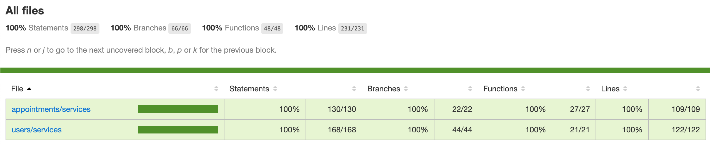

<p align="center"></p>

# GoBarber Back-end

<p align="center">Autor: Jobson Gilberto Barros Amorim &lt;jobsonita@gmail.com&gt;</p>

Baseado nas aulas do curso [GoStack](https://rocketseat.com.br/gostack) (turma 11) da Rocketseat.

<p align="center"></p>

## Sobre este projeto

Este projeto demonstra a aplicação de conceitos de segurança, cache e notificações em um back-end com testes automatizados, bem como adaptações para colocá-lo em produção. Para guiar o desenvolvimento, as funcionalidades deste sistema estão descritas em [features.md](features.md).

Este repositório continua o desenvolvimento do back-end iniciado em [jobsonita/rocketseat-bootcamp-nivel02-modulo01](https://github.com/jobsonita/rocketseat-bootcamp-nivel02-modulo01) e continuado em [jobsonita/rocketseat-bootcamp-nivel02-modulo02](https://github.com/jobsonita/rocketseat-bootcamp-nivel02-modulo02), [jobsonita/rocketseat-bootcamp-nivel04-modulo01](https://github.com/jobsonita/rocketseat-bootcamp-nivel04-modulo01) e [jobsonita/rocketseat-bootcamp-nivel04-modulo02](https://github.com/jobsonita/rocketseat-bootcamp-nivel04-modulo02).

Para maiores detalhes sobre o passo-a-passo da configuração do projeto, utilize a seção "Comandos utilizados na construção do projeto" deste readme em conjunto com o detalhamento dos [commits](https://github.com/jobsonita/rocketseat-bootcamp-nivel04-modulo03/commits/master) deste repositório.

Este projeto pode ser usado em conjunto com o front-end disponibilizado em [jobsonita/rocketseat-bootcamp-nivel03-modulo02](https://github.com/jobsonita/rocketseat-bootcamp-nivel03-modulo02).

## Dependências Globais

É necessário ter [Node](https://github.com/nvm-sh/nvm) e [Yarn](https://yarnpkg.com) instalados.

## Bibliotecas e ferramentas utilizadas

- express
- typescript
- eslint + prettier (padronização de código)
- typeorm (com PostgreSQL, biblioteca pg)
- jsonwebtoken (autenticação)
- multer (configurado para armazenamento local)
- tsyringe (injeção de dependências)
- jest (testes automatizados)
- nodemailer (envio de emails, fake smtp com Ethereal Email)
- handlebars (formatação de mensagens)
- [VS Code](https://code.visualstudio.com) (editor de código preferido)
- Docker (gerenciador de contêiners)
- Contêiner postgres (através do Docker)
- Postbird ou DBeaver (PostgreSQL GUI client)
- Insomnia (simulação de requisições HTTP REST)

## Instalação e execução

Com um terminal aberto na raiz do projeto, execute:

```
yarn
```

Após a instalação das bibliotecas, instale o Docker em sua máquina e crie uma réplica do contêiner postgres no docker:

```
docker run --name gostack_postgres -e POSTGRES_PASSWORD=your_password -p 5432:5432 -d postgres:11
```

O contêiner será ativado por padrão, mas confira usando a primeira linha abaixo e, se o contâiner não estiver ativo, execute a segunda linha para ativá-lo:

```
docker ps -a
docker start gostack_postgres
```

Após a criação do banco de dados, use um cliente sql de sua preferência (como Postbird ou DBeaver) para se conectar ao docker e crie um banco de dados chamado "gobarber". Em seguida, faça uma copia do arquivo .env.example com o nome .env e preencha os dados de conexão:

```
TYPEORM_CONNECTION = postgres
TYPEORM_HOST = localhost
TYPEORM_PORT = 5432
TYPEORM_USERNAME = postgres
TYPEORM_PASSWORD = your_password
TYPEORM_DATABASE = gobarber
TYPEORM_LOGGING = true
TYPEORM_ENTITIES_DIR = src/modules/*/infra/typeorm/entities
TYPEORM_MIGRATIONS_DIR = src/shared/infra/typeorm/migrations
TYPEORM_ENTITIES = src/modules/*/infra/typeorm/entities/*.ts
TYPEORM_MIGRATIONS = src/shared/infra/typeorm/migrations/*.ts
```

Com o terminal aberto na raiz do projeto, execute a migração das tabelas:

```
yarn typeorm migration:run
```

Finalmente, com um terminal aberto na raiz do projeto, execute:

```
yarn dev:server
```

Utilize uma ferramenta como o Insomnia para fazer requisições nas rotas descritas nos arquivos da pasta src/routes.

```
GET 'http://localhost:3333/appointments'
```

## Testes e análise de cobertura

Após a instalação das bibliotecas, com um terminal aberto na raiz do projeto, execute:

```
yarn test
```

Após a conclusão dos testes, será gerada uma pasta `coverage` na raiz do projeto. Um relatório bem formatado pode ser visto em `coverage/lcov-report/index.html`.

## Comandos utilizados na construção do projeto

Caso deseje configurar um projeto seguindo os passos dos commits, listo abaixo os comandos executados nesta terceira parte da configuração. Este projeto utiliza como base o projeto [jobsonita/rocketseat-bootcamp-nivel04-modulo02](https://github.com/jobsonita/rocketseat-bootcamp-nivel04-modulo02).
